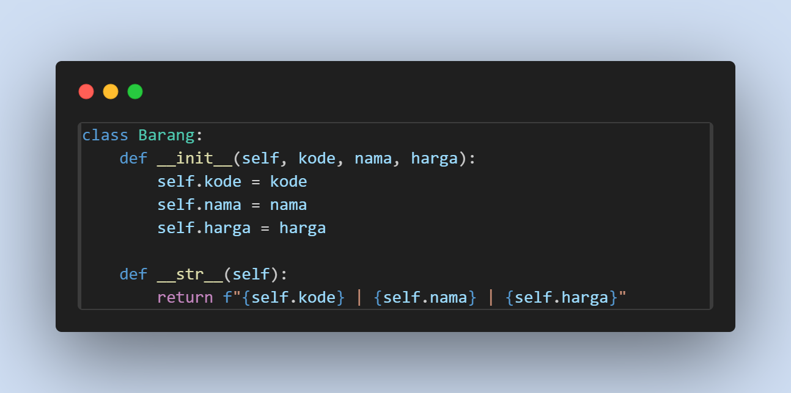
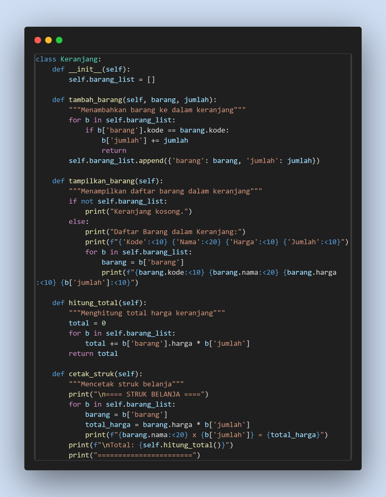
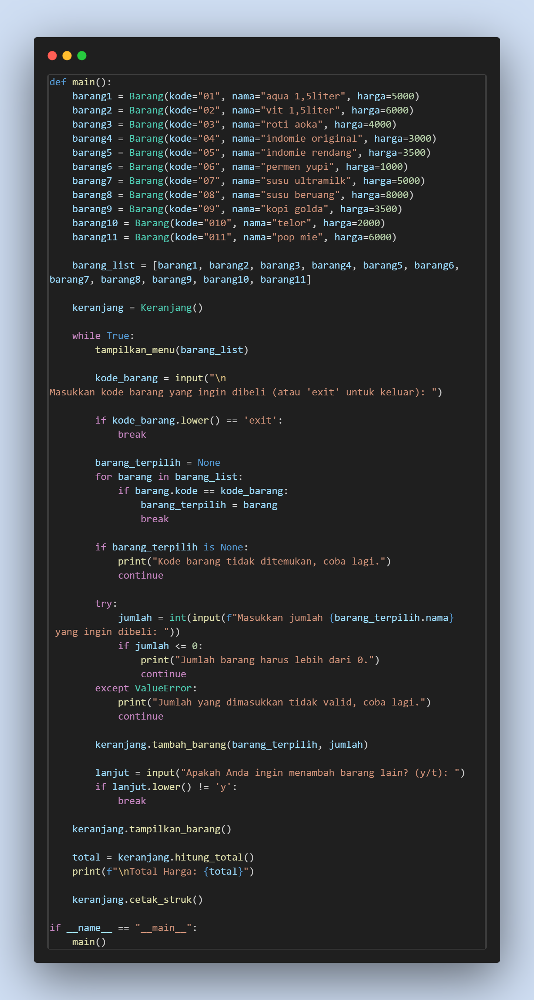

# Kasir1
## Link presentasi program kasir sederhana: 

## 1. Kelas Barang

Penjelasan
- __init__ digunakan untuk menginisialisasi objek Barang dengan atribut code, nama, dan harga.
- Fungsi __str__ digunakan untuk mengembalikan representasi string dari objek Barang. jadi, jika objek Barang diprint hasilnya akan berupa string.

## 2. Kelas keranjang 

Penjelasan
1. tambah_barang: menambahkan barang kedalam keranjang, jika barang sudah ada di dalam keranjang maka hanya tinggal menambahkan jumlahnya saja.
2. tampilkan_barang: menampilkan barang yang ada di dalam keranjang beserta code, nama, jumlah, dan harganya.
3. hitung_total: menghitung total seluruh barang yang ada didalam keranjang.
4. cetak_struk: mencetak struk belanja, dan menampilkan seluruh barang yang dipilih pengguna.

## Contoh main program

Di bagiann main ini, program menampilkan menu barang, meminta input pengguna untuk memilih barang yang ingin dibeli untuk ditambahkan kedalam keranjang, lalu menampilkan total harga dan mencetak struk.
